# 主页维护指南
## Before everything
网站域名是[username].github.io，每次更改后需要执行(**使用vsode则可以直接用下面的GUI界面**)
```
git add .
git commit -m "update info"
git push 
```
命令将最新内容推至git仓库，建议使用vscode进行版本维护和提交。网页显示大致有半分钟延迟。

按照下面提交更改

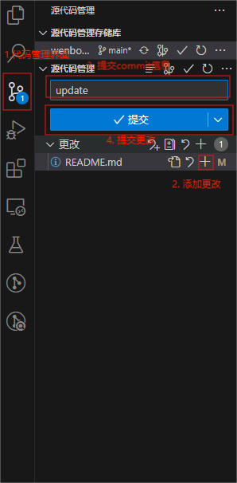

将更改push到github仓库

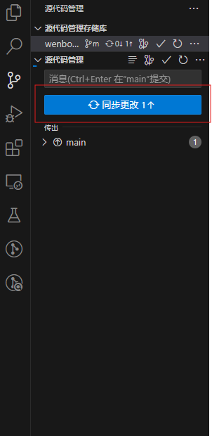

## 1. 下载git并克隆仓库至本地
1. 按照[git官方](https://git-scm.com/book/zh/v2/%E8%B5%B7%E6%AD%A5-%E5%AE%89%E8%A3%85-Git)提示安装git(总结如下)：
    - MAC
        - 打开终端
        - 如果没有homebrew先下载homebrew
            ```
            /bin/bash -c "$(curl -fsSL https://raw.githubusercontent.com/Homebrew/install/HEAD/install.sh)"
            ```
        - 安装git
            ```
            brew install git
            ```
    - Windows
        - 下载[installer](https://github.com/git-for-windows/git/releases/download/v2.44.0.windows.1/Git-2.44.0-64-bit.exe)并按照提示安装git
2. 配置git用户信息
    ```
    # config username
    git config –global user.name "Your Name"

    # config email
    git config –global user.email "your-email@example.com"

    # generate ssh key, just enter to skip path config and password
    ssh-keygen -t rsa -b 4096 -C "your-email@example.com"

    # output key info
    cat ~/.ssh/id_rsa.pub

    # 将公钥复制到剪贴板。然后，登录Git账户，导航到设置页面，找到SSH and GPG keys选项，点击”New SSH key”按钮，将复制的公钥粘贴到相应的输入框中并保存。

    # verify you configuration
    ssh -T git@github.com
    ```
    如果登录或者克隆仓库时仍然需要密码，按照下面的方式生成key并作为密码输入（**可能用不上**）
    
    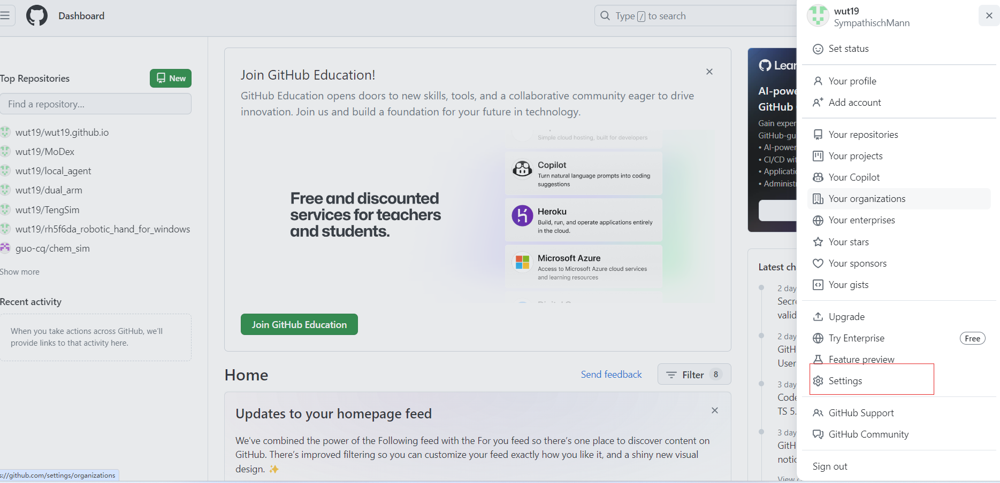
    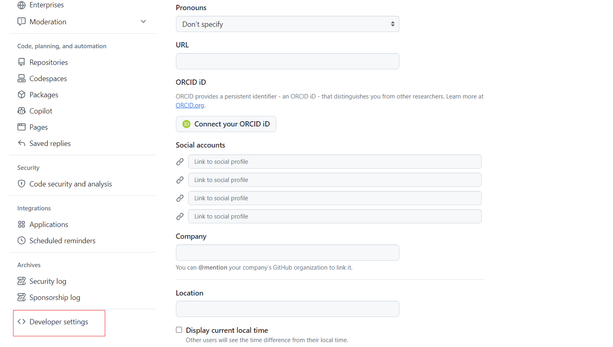
    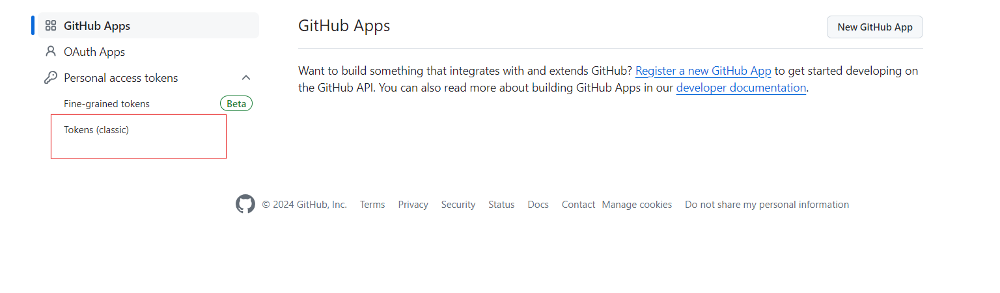
    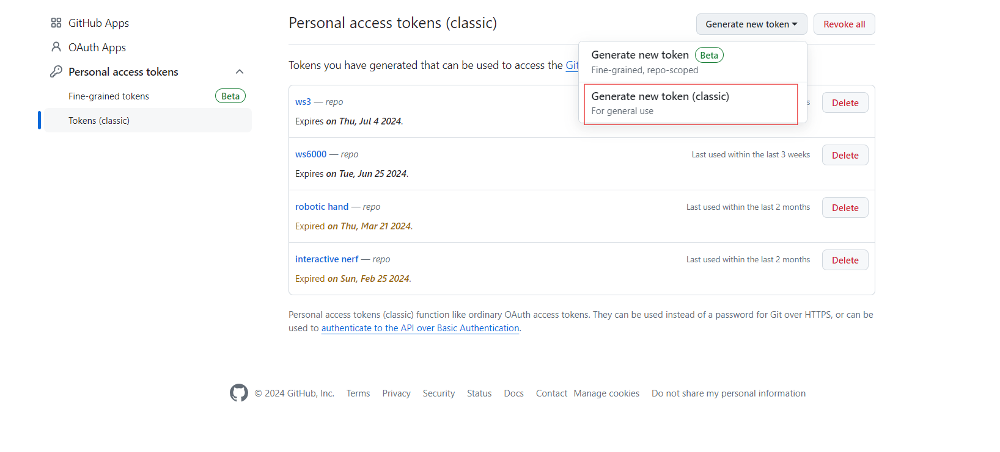
    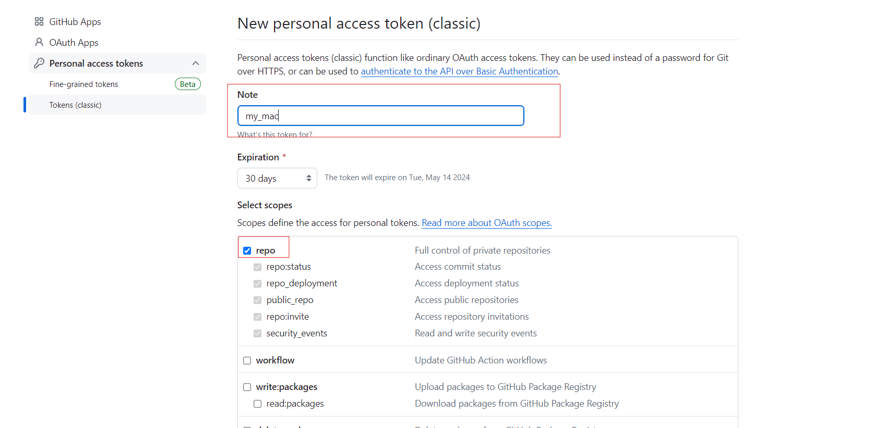
    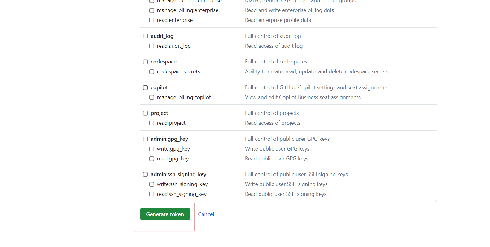
    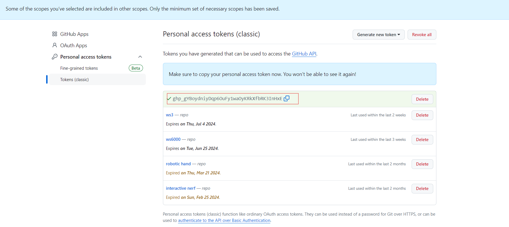

    复制该密钥作为登录密码

3. 克隆仓库至本地
    ```
    git clone path_to_your_repo.git
    ```
## 2. 文件结构及介绍（仅介绍维护时可能需要的文件，需要丁老师修改的地方已经标注）

- username.github.io
    - _config.yml (**需要修改bio，范例里是Shan Luo的enthusiasic robotics researcher**)

        配置左侧信息，仅需修改内容
        
        

        可修改的地方如下：
        左上角的“**Wenbo Ding**”超链接

        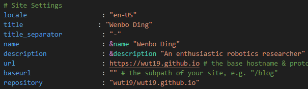

        下方的所有个人信息

        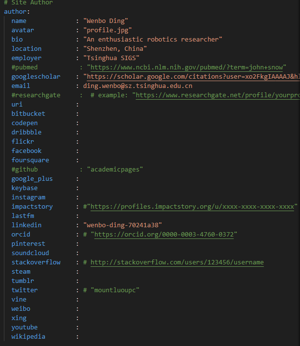

    - _data
        - navigation.yml(**如需修改导航栏内容可进行修改**)

            用于配置导航栏
            

            通过更改内容可以修改导航栏，title表示导航栏上的显示，url是到_pages/目录下同名文件的链接（**建议不修改或者只修改title**）
            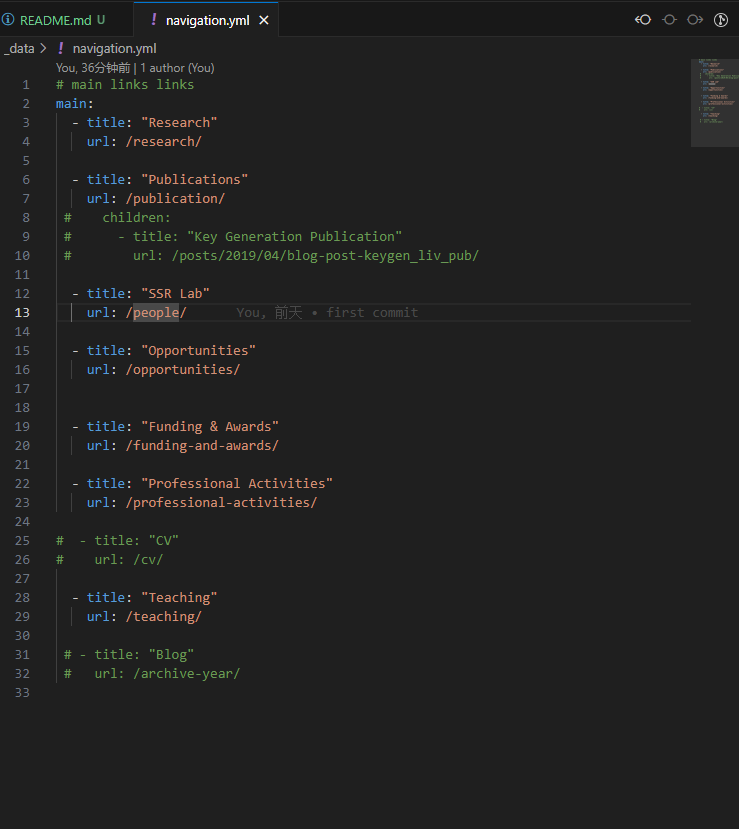

    - _pages(**包含所有页面内容**)
        - about.md (**需要修改**)
        
            默认页
            

            包含
            - intro
            - research interests
            - opennings
            - news
        - research.md

            研究展示页，可插入动图
            
        -  publication.md

            publications
            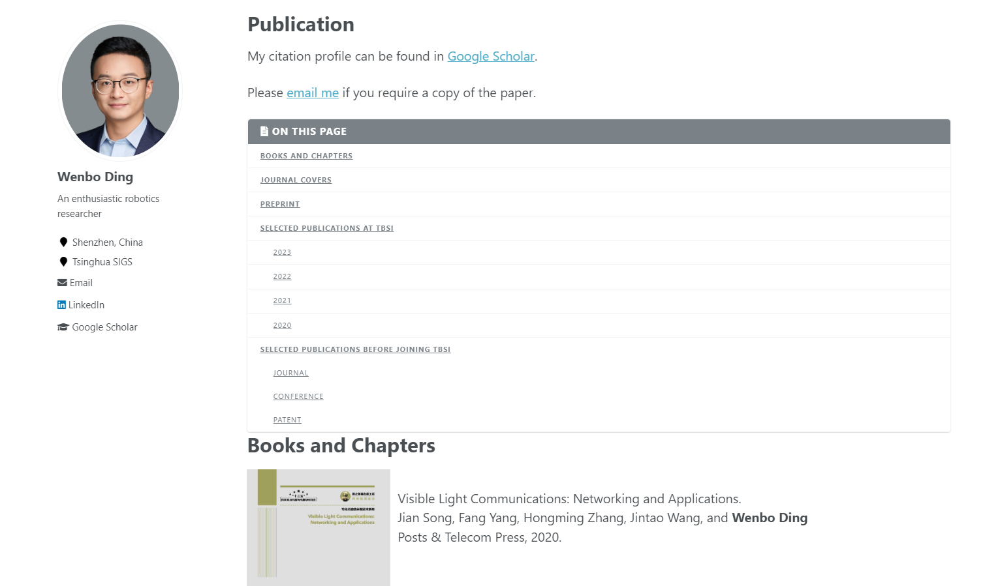
        - people.md

            实验室成员
            
        - opportunities.md(**暂未修改，使用Shan Luo网页填充;需要修改或者在导航栏删除**)
        - funding-and-awards.md(**暂未修改，使用Shan Luo网页填充;需要修改或者在导航栏删除**)
        - professional-activities.md(**暂未修改，使用Shan Luo网页填充;需要修改或者在导航栏删除**)
        - teaching.md(**暂未修改，使用Shan Luo网页填充;需要修改或者在导航栏删除**)
        - news.md
            维护news，该页面从默认页（aboutme）的news超链接进入
            

            

