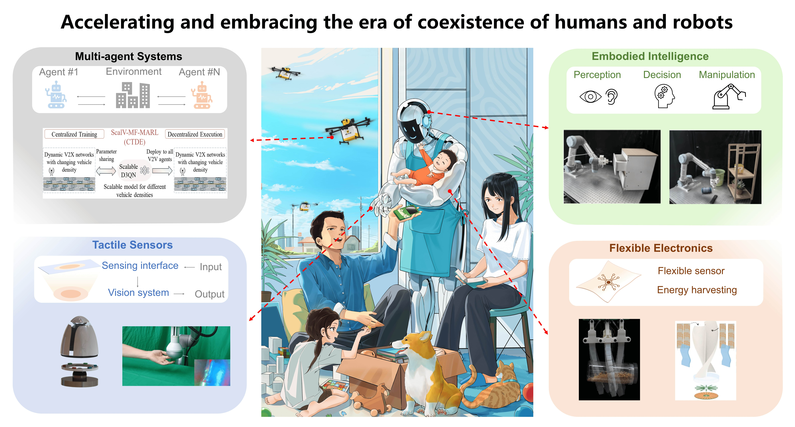

 

Dr. Wenbo Ding is now a tenured associate professor and leading the smart sensing and robotics (SSR) lab in Shenzhen International Graduate School, Tsinghua University. He received the B.E and Ph.D. degrees (both with the highest honors) from the Department of Electronic Engineering, Tsinghua University, Beijing, China, in 2011 and 2016, respectively, and then worked as a postdoctoral research fellow in Materials Science and Engineering at Georgia Tech, Atlanta, GA, under the supervision of Professor Z. L. Wang from 2016 to 2019. He has published over 70 journal and conference papers and received many prestigious awards, including the National Early-Career Award, the IEEE Scott Helt Memorial Award for the best paper published in IEEE Transactions on Broadcasting, the 2019/2022 Natural Science Award (Second Prize) from Institute of Electronics, the Gold Medal and Special Prize at the 47th International Exhibition of Inventions of Geneva, the Tsinghua Top Grade Scholarship (highest student honor in Tsinghua), the Tsinghua Lin Feng Counsellor Prize (highest student mentor honor in Tsinghua). His research interests mainly focus on robotic tactile sensing techniques based on triboelectric nanogenerators, flexible electronics, visuo-tactile sensors, and deep learning, with the strong and unique interdisciplinary background of information and materials science.

## Research Interests
* Signal processing for robotics
* Embodied AI
* Human-computer interfaces
* Multi-agent reinforcement learning

<!--  -->

## Contact
**Email**:  ding.wenbo at sz.tsinghua.edu.cn;   vincentdwb at gmail.com

**Web**: [https://ssr-group.net/](http://ssr-group.net/); [SlGS Official Website](https://www.sigs.tsinghua.edu.cn/dwb/)

**Address**: Room 1105, Information Technology Building, Tsinghua Shenzhen, International Graduate School, Shenzhen, Guangdong 518055

## Openings
I am always looking for the self-motivated students with the background of electrical engineering, electronic engineering, computer science, mechanical engineering and materials science, and especially the ones who enjoy the experience to build up a working system. If you are interested in working with us as a PostDoc or PhD / Master / Visiting student, please contact me. For those applying for the TBSI graduate programs (master and PhD), please remeber to choose the **Big data and artificial intelligence** direction.

Please email me with a copy of your CV if you are interested. 
<!-- Visit [Opportunities](/opportunities/) for all the opportunities. -->

## [News](/news/)
* **[2026/01] Our work on biomimetic multimodal tactile sensor inspired by multispectral vision of pigeons (SuperTac) has been published on [Nature Sensors Volume 1](https://www.nature.com/articles/s44460-025-00006-y). Congrates to Shoujie and Tong!**
* **[2025/09] Our work on flexible integrated robot has been accepted by Science Advances (SA) as front cover. Congrats to Xiaosa!**
* [2026/07] Our paper on wearable electronics got accepted by Nature Communications! Congrats to Yimeng and all the collaborators.
* [2026/06] I am honored to receive the Sensors Young Investigator Award. Thank you for the recognition from the award committee and all the efforts from my group members. The interview could be found at: [https://www.mdpi.com/journal/sensors/announcements/17253](https://www.mdpi.com/journal/sensors/announcements/17253)
* [2026/03] I am very honored to be invited to serve as the associate editor for IEEE Robotics and Autumation Letters (RA-L)!
* [2026/03] I am very honored to be selected for EAI Pioneer 20 by ModelScope and also congrats to Shoujie being selected for [EAI Next 20](https://modelscope.cn/brand/view/EAI-100). 
* [2026/02] One paper got accepted by CVPR 2026. Congrats to Lingfeng!
* [2026/02] Two papers got accepted in ICRA 2026, congrats to Kit-Wa, Junhao, Yushan and Shilong. See you in Vienna!
* [2026/01] Three of our papers have been accepted to ICLR 2026! These works cover stable off-policy RL for flow policies, second-order non-parametric policy gradient algorithms, and improvements in sample-efficient reinforcement learning. Congrats to Yixian and Chao!
* [2026/01] Our work on Ensemble MARL for heterogeneous UAV swarm target search has been accepted by IEEE TMC. Congrats to Xuan, Changxu, Ziyuan and Yixian!
* [2026/01] Our work on Event-based Visuotactile Perception with Active Vibration has been accepted by IEEE Transaction on Robotics (T-RO)! Congrats to Shoujie and Changqing!
* [2026/01] Two papers got accepted in ICASSP 2026. Congrats to Baiqiao and Hao.
* [2026/01] Our work on cross-embodiment learning for 3D visuomotor policy has been accepted by IEEE Robotics and Automation Letters (RA-L). Congrats to Tong and Shoujie!
* [2025/12] Our work on near-sensor computing and memory system has been accepted by Device as the front cover. Congrats to Qinghao!
* [2025/11] Hongfa and Chun received the China Postdoc General Projects, congrats!
* [2025/11] One paper got accepted in AAAI 2026, congrats to Lingfeng!
* [2025/11] I am invited to join the Nano Energy’s Early Career Researcher Board. Thank you for the nomination and recognition.
* [2025/10] I am humbled to be selected as the New Generation Star at IROS 2025. Thank the committee for this recognition and this honor could not be possible without the efforts of all group members.
* [2025/08] Our work on robot liquid manipulation has been accepted by Journal of Field Robotics (JFR) as front cover. Congrats to Yan!
* [2025/07] Our work on Self-Powered Optical Communication: Opportunities, Challenges and Future Prospects has been accepted by Advanced Energy Materials (AEM). Congrats to Zihan, Jiarong and Hongfa!

Please visit [News](/news/) for all the news.

