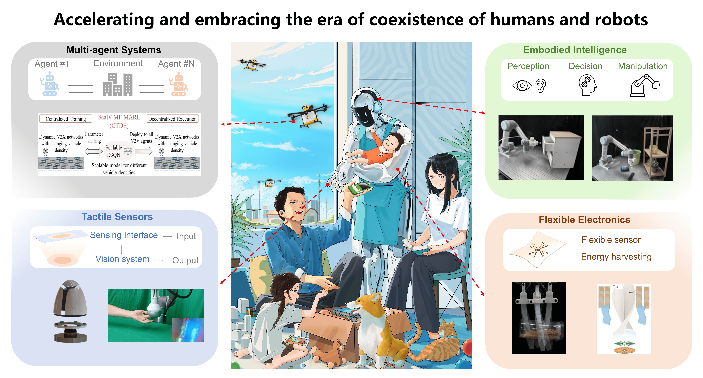

 

Dr. Wenbo Ding is now an associate professor and leading the smart sensing and robotics (SSR) group in Shenzhen International Graduate School, Tsinghua University. He received the B.E and Ph.D. degrees (both with the highest honors) from the Department of Electronic Engineering, Tsinghua University, Beijing, China, in 2011 and 2016, respectively, and then worked as a postdoctoral research fellow in Materials Science and Engineering at Georgia Tech, Atlanta, GA, under the supervision of Professor Z. L. Wang from 2016 to 2019. He has published over 70 journal and conference papers and received many prestigious awards, including the National Early-Career Award, the IEEE Scott Helt Memorial Award for the best paper published in IEEE Transactions on Broadcasting, the 2019 Natural Science Award (Second Prize) from Institute of Electronics, the Gold Medal and Special Prize at the 47th International Exhibition of Inventions of Geneva, the Tsinghua Top Grade Scholarship (highest student honor in Tsinghua), the Tsinghua Lin Feng Counsellor Prize (highest student mentor honor in Tsinghua). His research interests are diverse and interdisciplinary, which include self-powered sensors, energy harvesting, wearable devices for health and soft robotics with the help of signal processing, machine learning and mobile computing.

## Research Interests
* Signal processing for robotics
* Embodied AI
* Human-computer interfaces
* Multi-agent reinforcement learning

<!--  -->

## Contact
**Email**:  ding.wenbo at sz.tsinghua.edu.cn;   vincentdwb at gmail.com

**Web**: [https://ssr-group.net/](http://ssr-group.net/); [SlGS Official Website](https://www.sigs.tsinghua.edu.cn/dwb/)

**Address**: Room 1105, Information Technology Building, Tsinghua Shenzhen, International Graduate School, Shenzhen, Guangdong 518055

## Openings
I am always looking for the self-motivated students with the background of electrical engineering, electronic engineering, computer science, mechanical engineering and materials science, and especially the ones who enjoy the experience to build up a working system. If you are interested in working with us as a PostDoc or PhD / Master / Visiting student, please contact me. For those applying for the TBSI graduate programs (master and PhD), please remeber to choose the **Big data and artificial intelligence** direction.

Please email me with a copy of your CV if you are interested. 
<!-- Visit [Opportunities](/opportunities/) for all the opportunities. -->

## [News](/news/)
* [2025/01] Five papers have been accepted by IEEE ICRA 2025, see you in Atlanta! Congrats to Shoujie, Ran, Xiaosa, Chenxin!
* [2025/01] Our work on enhanced low-rank approximation technique has been accepted by TMLR. Congrats to Yuzhu!
* [2025/01] Our work on Sample efficiency RKHS Reinforcement Learning algorithm has been accepted by ICLR 2025. Congrats to Yixian and Huaze!
* [2025/01] Our work on Mean-Field Aided QMIX: A Scalable and Flexible Q-Learning Approach for Large-Scale Agent Groups has been accepted by ICASSP 2025. Congrats to Enze and Huaze!
* [2025/01] I have been invited to join the advisory board member of Electronics and Signal Processing.
* [2024/12] Our work on Mechanoluminescent Visuotactile Sensor for Intelligent Interactions has been accepted by Advanced Functional Materials. Congrats to Kit-Wa, Henry and Eric!
* [2024/11] Shilong won the first prize in [Low-altitude Economic Intelligent Flight Management Challenge](https://mp.weixin.qq.com/s/af1aCr-GrmgQDyoqyYVVeA)! Congrats!
* [2024/11] Shoujie won the [Autonomous Robotic Technology Seminar (ARTS) Scholarship](https://mp.weixin.qq.com/s/rtbFD72n1u_5y1bdIoZMUg)! Congrats!
* [2024/11] Shilong won the National Graduate Scholarship and other 14 students (Jiarong, Shoujie, Hongfa, Xiaosa, Tong Wu, Runze, Liguang, Xuan Zhang, Ran Yu, Jiaqi, Zhancong, Xinyue, Changxu and Jingyang) won the university and school level scholarhips! Congrats!
* [2024/10] I have been invited to join the youth editorial board of Robot Learning.
* [2024/10] I have been invited to serve as the area chair of IEEE ICASSP 2025.
* [2024/09] Our work on the wearable vibrotactile guidance has been accepted by lEEE Robotics and Automation Letters (lF: 4.6). Congrats to Xiaosa and Runze!
* [2024/09] Our review on the application of nanogenerators in robotics has been accepted by the International Journal of Extreme Manufacturing (IF:16.1). Congrats to Hongfa and Liguang. 
* [2024/08] Our work on Multispectral Multimodal Visuotactile Sensor has been accepted by IEEE Transactions on Robotics. Congrats to Shoujie!
* [2024/07] Our work on a hybrid wind and raindrop energy harvesting operating on savonius turbine has been accepted by Nano Energy (lF: 16.8) as front cover. Congrats to Kit-Wa, Zenan
and Yuchao!
* [2024/06] Our work on the Scalable Mean-Field MARL Framework for V2X resource allocation has been accepted by IEEE Transactions on Intelligent Vehicles (IF: 14.0). Congrats to Xuan and Hengxi!
* [2024/06] Our review on visuotactile sensors has been accepted by IEEE Journal of Selected Topics in Signal Processing (JSTSP). Congrats to Shoujie!
* [2024/06] Our work on tactile sensing of quadruped robot has been accepted by IEEE Sensors journal (IF: 4.3). Congrats to Ziwu and Chenchang!
* [2024/05] I have been invited to deliver a seminar at IEEE Distinguished Webinar Series. See you this August on the air!
* [2024/02] Our work on CS-TENG theory has been accepted by Energy & Environmental Science (IF: 32.5). Congrats to Hongfa!
* [2024/01] Four papers got accepted by IEEE ICRA 2024. Congrats and See you in Japan!
* [2024/01] Jiyu will join Huazhong University of Science and Technology as associate professor. Huge congrats and thank you for your contribution to SSR group!
* [2023/12] Three papers got accepted by IEEE ICASSP 2024. Congrats and See you in Korea!
* [2023/11] Our work on Communication-efficient FL has been accepted by IEEE Transactions on Mobile Computing (IF: 7.9, CCF-A). Congrats to Zihao and Yuzhu!
* [2023/10] Shoujie won the National Graduate Scholarship and other 14 students won the university and school level scholarhips! Congrats!
* [2023/10] Our work on visuo-tactile enabled swab sampling has won the IEEE IROS 2023 **Best Application Award finalist**. Congrats to Shoujie and Mingshan!
* [2023/09] Our work on broad range stiffness sensor has been accepted by Nano-Micro Letters (IF: 26.6). Congrats to Ziyi and all!
* [2023/09] Huaze received the IEEE IROS 2023 RAS Travel Grant. Congrats!
* [2023/09] Shoujie won the future scholar award for PhD students. (Only 4 in Tsinghua SIGS) Congrats!
* [2023/08] Our work on federated hashing has been accepted by IEEE Transactions on Parallel and Distributed Systems (IF: 5.3, CCF-A). Congrats to Meilin!
* [2023/06] Two papers got accepted by IEEE IROS 2023. Congrats to Shoujie and Huaze!
* [2023/06] Hengxi received the excellent master thesis award! Congrats!
* [2023/06] Shoujie received the Tsinghua Future Scholar Award for PhD student. (Only 4 out of all SIGS fresh PhD students) Congrats!
* [2023/05] Our work on visuo-tactile sensor for transparent object grasping has been accepted by IEEE Transactions on Robotics. Congrats to Shoujie.
* [2023/04] Our work on triboelectric gait sensor for human activity recognition and indentification has been accepted by Nano Energy (IF: 19.06). Congrats to Jiarong, Zixuan and Zihan.
* [2023/03] Zihan received the IEEE ICRA 2023 RAS Travel Grant. Congrats!
* [2023/03] Together with many world renowned experts, we organize a special issue on AI in Signal and Data Science in IEEE JSTSP. Your support and attention are warmly welcomed. Link for more details.
* [2023/03] My course “Nanogenerators and Self-powered Systems” has ranked top 5% in the student evaluation (Second time). Thank you for your support.
* [2023/03] Our review paper on TENG for IoT published in Intelligent and Converged Networks has won the 2023 excellent paper award. Congrats to Jiarong, Zihan and all our co-authors.
* [2023/01] Our proposal for IEEE JSTSP special issue on robotics has been approved. Your support and attention are warmly welcomed. Link for more details.
* [2023/01] Our work on soft robot self sensing has been accepted by IEEE ICRA. Congrats to Zihan and Eric!

Please visit [News](/news/) for all the news.

