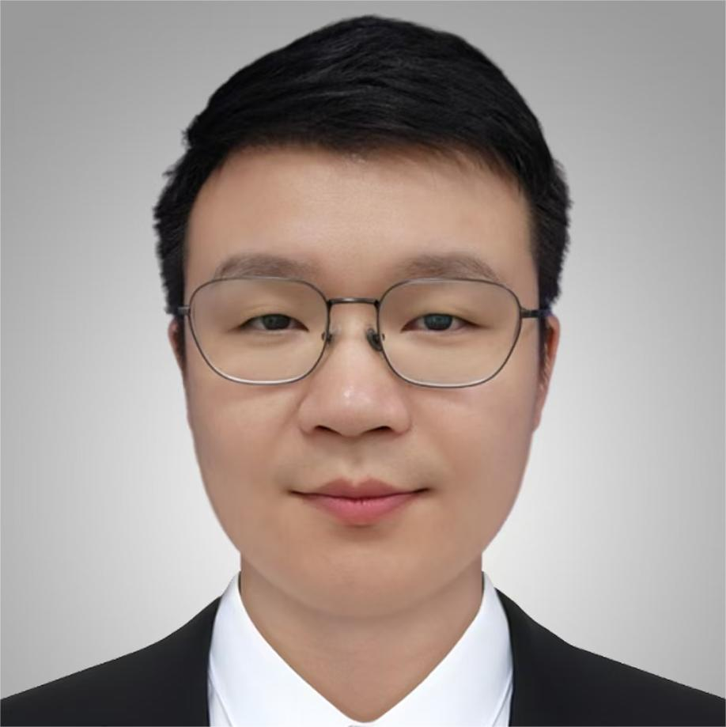
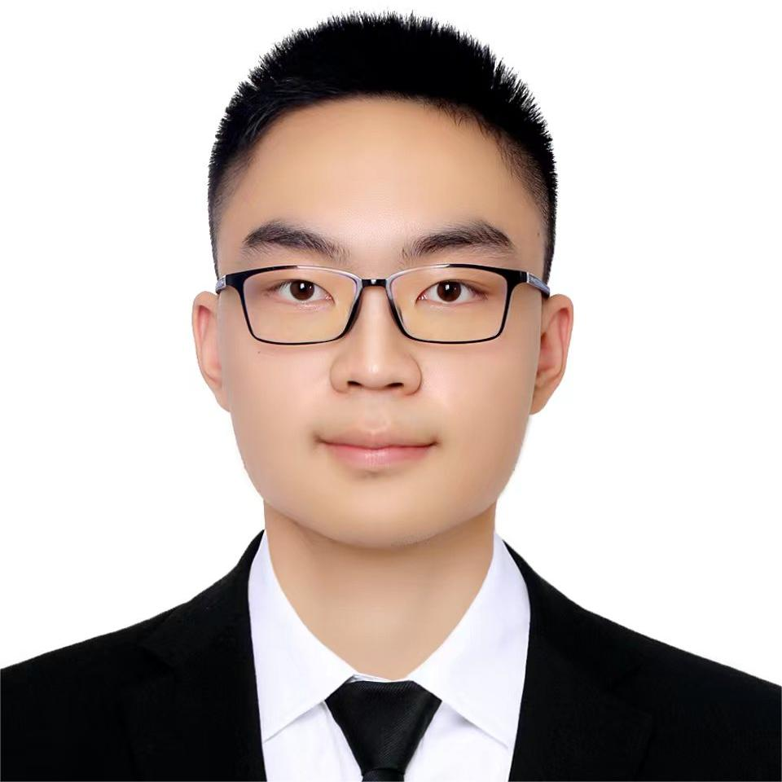
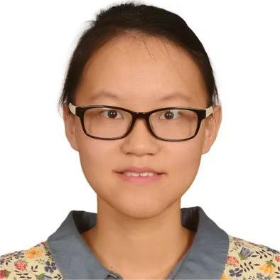
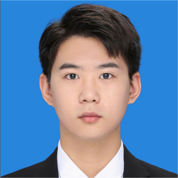
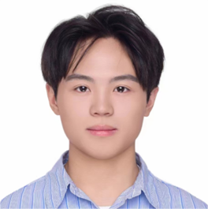

    <h2>Postdoc</h2>
    

        

            
             
            <a href="https://www.researchgate.net/profile/Chuqiao-Lyu">Chuqiao Lyu</a> 
            2024 - 
        
 
        

            
             
            

                Hao Guo 
                2024 - 
            

            

                Hao Guo 
                Embodied AI 
                BEng(YSU), PhD(USTC) 
            

        
 
        

              
            

                Hongfa Zhao 
                2025 - 
            

            

                Hongfa Zhao 
                TENG 
                BEng&MS(DMU), PhD(THU) 
            
            
        

        <!-- 

            
             
            Yuzhu Mao 
            2023 - 
        
  -->
    

     
     
     
     
     
     
     
     
    <h2>PhD Students</h2>
    

        <!-- 

            
             
            <a href='http://zh-wang.top'>Zihan Wang</a> 
            2019 -  -->
        <!-- 
  -->
        

              
            

                Ziwu Song 
                2020 - 
            

            

                Ziwu Song 
                Tactile Sensing 
                BEng(NJUST) 
            

        

        <!-- 

              
            

                Shoujie Li 
                2020 - 
            

            

                Shoujie Li 
                Robotics 
                BEng(UPC) 
            

        
 -->
        

              
            

                Chao Wang 
                2020 - 
            

            

                Chao Wang 
                MARL 
                BS(ZJU) 
            

        

        <!-- 

              
            

                Xiaosa Li 
                2021 - 
            

            

                Xiaosa Li 
                EM Haptic Display 
                BEng&MS(WHU) 
            
            
        
 -->
        <!-- 

              
            

                Hongfa Zhao 
                2021 - 
            

            

                Hongfa Zhao 
                TENG 
                BEng&MS(DMU) 
            
            
        
 -->
        

              
            

                Kit-Wa Sou 
                2021 - 
            

            

                Kit-Wa Sou 
                Tactile Sensor 
                BEng(NCTU), MS(THU) 
            

        

        

              
            

                <a href="https://huazetang.github.io">Huaze Tang</a> 
                2021 - 
            

            

                <a href="https://huazetang.github.io">Huaze Tang</a> 
                MARL 
                BEng(SEU) 
            

        

        

              
            

                Qinghao Xu 
                2022 - 
            

            

                Qinghao Xu 
                Wireless Bioelectronics 
                BEng&MS(NJUPT) 
            
            
        

        

              
            

                <a href="http://www.jiarongli.work">Jiarong Li</a> 
                2022 - 
            

            

                <a href="http://www.jiarongli.work">Jiarong Li</a> 
                Ubiquitous Sensing 
                BEng(UESTC), MS(THU)
            

        

        

              
            

                Chenxin Liang 
                2023 - 
            

            

                Chenxin Liang 
                Visible Light Sensing 
                BEng(TJU)
            

        

        

              
            

                <a href="https://tongwu19.github.io/">Tong Wu</a> 
                2023 - 
            

            

                <a href="https://tongwu19.github.io/">Tong Wu</a> 
                Dexterous Manipulation 
                BEng(THU) 
            

        

        

              
            

                Jiayi Chen 
                2024 - 
            

            

                Jiayi Chen 
                Flexible Electronics 
                BEng(SCUT) 
            

        

        

              
            

                Chihan Xu 
                2024 - 
            

            

                Chihan Xu 
                Adversarial Learning 
                BS(LZU) 
            

        

        

              
            Junhao Gong 
            2024 - 
        

        

              
            

                Baiqiao Wang 
                2025 - 
            

            

                Baiqiao Wang 
                Robotics 
                BEng(THU) 
            

        

    

     
     
     
     
     
     
     
     
     
     
     
     
     
     
     
     
     
     
     
     
     
     
     
    <h2>Master Students</h2>
    

        <!-- 

              
            

                Zhancong Xu 
                2022 - 
            

            

                Zhancong Xu 
                Visible Light Sensing 
                BEng(THU)
            

        
 -->
        <!-- 

              
            

                <a href="https://charon-bo.github.io/">Shilong Mu</a> 
                2022 - 
            

            

                <a href="https://charon-bo.github.io/">Shilong Mu</a> 
                Embodied AI 
                BEng(CUMT) 
            

        
 -->
        <!-- 

              
            

                Zehao Li 
                2022 - 
            

            

                Zehao Li 
                Embodied AI 
                BS(NKU) 
            

        
 -->
        <!-- 

              
            

                Changshuo Ge 
                2022 - 
            

            

                Changshuo Ge 
                HCI 
                BEng(THU) 
            

        
 -->
        <!-- 

              
            

                Siqi Ping 
                2022 - 
            

            

                Siqi Ping 
                Federated Learning 
                BS(JLU) 
            

        
 -->
        <!-- 

              
            

                Runze Zhao 
                2022 - 
            

            

                Runze Zhao 
                Magnetic Actuation 
                BS(XMU) 
            

        
 -->
        <!-- 

              
            

                Shuting Zhang 
                2022 - 
            

            

                Shuting Zhang 
                Machine learning 
                BEng(XDU) 
            

        
 -->
        <!-- 

              
            

                Zhenpeng Shi 
                2022 - 
            

            

                Zhenpeng Shi 
                MARL 
                BS(WHU) 
            

        
 -->
        <!-- 

              
            

                Wang Sing Chan 
                2022 - 
            

            

                Wang Sing Chan 
                Soft Robotics 
                BEng(UW) 
            

        
 -->
        <!-- 

              
            

                Jiaqi Li 
                2022 - 
            

            

                Jiaqi Li 
                Federated Learning 
                BS(USTC) 
            

        
 -->
        

              
            

                Xinyue Chai 
                2023 - 
            

            

                Xinyue Chai 
                HCI 
                BEng(NUAA) 
            

        

        

              
            

                Ruize Zhang 
                2023 - 
            

            

                Ruize Zhang 
                MARL 
                BEng(THU) 
            

        

        

              
            

                Changxu Wei 
                2023 - 
            

            

                Changxu Wei 
                MARL 
                BEng(SEU) 
            

        

        

              
            

                Xuan Zhang 
                2023 - 
            

            

                Xuan Zhang 
                MARL 
                BEng(SYSU) 
            

        

        

              
            

                <a href="https://marcyu0303.github.io/">Ran Yu</a> 
                2023 - 
            

            

                <a href="https://marcyu0303.github.io/">Ran Yu</a> 
                Embodied AI 
                BEng(UESTC) 
            

        

        

              
            

                Xinting Yang 
                2023 - 
            

            

                Xinting Yang 
                MARL 
                BEng(THU) 
            

        

        

              
            

                <a href="https://liguangruan.github.io/">Liguang Ruan</a> 
                2023 - 
            

            

                <a href="https://liguangruan.github.io/">Liguang Ruan</a> 
                HCI 
                BEng(LZU) 
            

        

        

              
            

                Enze Zhang 
                2023 - 
            

            

                Enze Zhang 
                MARL 
                BS(HIT) 
            

        

        

              
            

                Jingyang Wang 
                2023 - 
            

            

                Jingyang Wang 
                Smart Sensing 
                BEng(WHUT) 
            

        

        

              
            

                Yixian Zhang 
                2024 - 
            

            

                Yixian Zhang 
                MARL 
                BS(SEU) 
            

        

        

              
            

                Yan Huang 
                2024 - 
            

            

                Yan Huang 
                Robotics 
                BEng(WHU) 
            

        

        

              
            

                Changqing Guo 
                2024 - 
            

            

                Changqing Guo 
                Tactile Sensing 
                BEng(SCUT) 
            

        

        

              
            

                Huijing Lin 
                2024 - 
            

            

                Huijing Lin 
                2024 - 
            

        

        

              
            

                Tongcheng Fang 
                2024 - 
            

            

                Tongcheng Fang 
                2024 - 
            

        

        

              
            

                <a href="https://scpsyl.github.io/">Yushan Liu</a> 
                2024 - 
            

            

                <a href="https://scpsyl.github.io/">Yushan Liu</a> 
                Embodied AI 
                BS(JLU) 
            

        

        

              
            

                Mingyang Li 
                2024 - 
            

            

                Mingyang Li 
                Embodied AI 
                BEng(HUST) 
            

        

        

              
            

                Xintao Chao 
                2024 - 
            

            

                Xintao Chao 
                Embodied AI 
                BEng(HIT) 
            

        

        

              
            

                Yisheng Yang 
                2024 - 
            

            

                Yisheng Yang 
                Interactive Media 
                BEng(XMU) 
            

        

        

              
            

                Wenxuan Zhu 
                2024 - 
            

            

                Wenxuan Zhu 
                Embodied AI 
                BS&BMgt(JLU) 
            

        

        

              
            

                Eric Chen 
                2024 - 
            

            

                Eric Chen 
                Robotics 
                BEng(UCSD) 
            

        

        

              
            

                Cong Zhang 
                2024 - 
            

            

                Cong Zhang 
                Embodied AI 
                BEng(HUST) 
            

        

        

              
            

                Zehao Wang 
                2024 - 
            

            

                Zehao Wang 
                Domain Specific Accelerator 
                BEng(BUAA) 
            

        

        

              
            

                Xingting Li 
                2025 - 
            

            

                Xingting Li 
                Embodied AI 
                BEng(USTB) 
            

        

        

              
            

                Han Liu 
                2025 - 
            

            

                Han Liu 
                Robotics 
                BEng(NEU) 
            

        

    

     
     
     
     
     
     
     
     
     
     
     
     
     
     
     
     
     
     
     
     
     
     
     
     
     
     
     
     
     
     
     
     
     
     
     
     
     
     
     
     
    <!-- <h2>Visiting Students</h2>
    

        

              
            

                Zimo Wang 
            

            

                Zimo Wang 
                Fiber Electronics 
                BEng(JNU), MS(NUS) 
            

        
 -->
        <!-- 

              
            Yangtao Chen 
        

        

              
            Pavel Kharitenko 
        
 -->
    <!-- 

     
     
     
     
     
     
     
      -->
    <h2>Alumni</h2>
    - Shoujie Li, Ph.D. Student (2025), now Post-Doctoral Fellow at Nanyang Technological University. 
    - Hongfa Zhao, Ph.D. Student (2025), now Post-Doctoral Fellow at Tsinghua SIGS. 
    - Xiaosa Li, Ph.D. Student (2025), now Post-Doctoral Fellow at Pengcheng Lab. 
    - Zhancong Xu, MS Student (2025), now Ph.D. Student at Tsinghua SIGS. 
    - Shilong Mu, MS Student (2025), now running a startup company. 
    - Zehao Li, MS Student (2025), now at ChinaMobileInternet (Guangzhou). 
    - Changshuo Ge, MS Student (2025), now at Bytedance (Shanghai). 
    - Siqi Ping, MS Student (2025). 
    - Runze Zhao, MS Student (2025), now at China Life (Beijing). 
    - Shuting Zhang, MS Student (2025), now at Shopee (Shanghai). 
    - Zhenpeng Shi, MS Student (2025), now RL engineer at Xiaomi (Beijing). 
    - Wang Sing Chen (Henry), MS Student (2025), now Ph.D. Student at CMU. 
    - Jiaqi Li, MS Student (2025), now at Nansha Smart City Big Data. 
    - Zimo Wang, Visiting Student (2024-2025), now Ph.D. Student at Nanyang Technological University. 
    - Dr. Jiyu Wang, Post-Doctoral Fellow (2020-2023), now Associate Professor at HUST. 
    - <a href='http://zh-wang.top'>Zihan Wang</a>, Ph.D. Student (2024), now Post-Doctoral Fellow at UCB. 
    - Zenan Lin, MS Student (2024), now working on hardware product development at Huawei. 
    - <a href="https://www.zihaozhao.site/">Zihao Zhao</a>, MS Student (2024), now Ph.D. Student at Georgia Tech. 
    - Ziyi Zhao, MS Student (2024), now at COSCO Shipping. 
    - Meilin Yang, MS Student (2024), now at Meituan. 
    - Zihao Ai, MS Student (2024), now at Bytedance. 
    - Eric Kai-Chong Lei, MS Student (2024), now in the product innovation department at Shokz. 
    - Chenchang Li, MS Student (2024), now Ph.D. Student at NUS. 
    - Zhentan Quan, MS Student (2024), now Ph.D. Student at Tsinghua University. 
    - Yuanquan Hu, MS Student (2024), now at Huawei. 
    - Ting Dong, MS Student (2024), now in Shanghai. 
    - Junji Yan, MS Student (2024), now Ph.D. Student at UIUC. 
    - Zixuan Xie, MS Student (2024), now working on large model in China Coal Research Institute.  
    - Mattesini Riccardo, MS Student (2023). 
    - <a href='https://dylan2020thu.github.io/'>Hengxi Zhang</a>, MS Student (2023). 
    - Jihong Yin, MS Student (2023), now Ph.D. student at the University of Macau. 
    - Xu Yang, MS Student (2023), now at Hongtu Technology in Ningbo. 
    - Yuchao Jin, MS Student (2023), now cloud technology engineer at Alibaba. 
    - <a href="https://yz-mao.github.io/">Yuzhu Mao</a>, MS Student (2023), Research Assistant (2023-2024), now senior engineer at Alipay.com Co., Ltd. 
    - Jiarong Li, MS Student (2022), now Ph.D. Student at SSR group. (Excellent Graduate of THU) 
    - Chengyue Lu, Research Assistant (2020-2023), now MS Student at University of Macau. 
    - Xiao Xiao, Research Assistant (2021), now Ph.D. Student at NUS. 
    - Yangtao Chen, Visiting Student (2024). 
    - Pavel Kharitenko, Visiting Student (2024). 
    - Rameesh Lakshan, Visiting Student (2024), now Ph.D. Student at Loughborough University. 
    - Qi Zhang, Visiting Student (2023), now Ph.D. Student at NUS. 
    - Mingshan He, Visiting Student (2022), now MS Student at Seoul National University. 
    - Xin Xia, Visiting Student (2021), now Research Assistant Professor at HKUST. 
    - Guoqiang Xu, Visiting Student (2021), now Post-Doctoral Fellow at CityU of HK. 
    - Jingjing Fu, Visiting Student (2021), now Post-Doctoral Fellow at PolyU of HK. 

