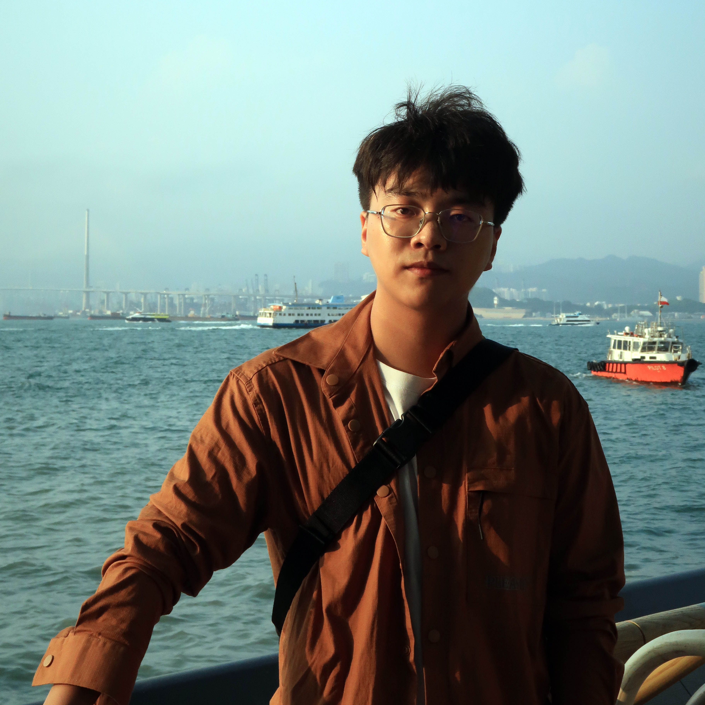

    <h3>Research Assistants</h3>
    

        

            
             
            Yuzhu Mao 
            2023 - 
        
 
    

     
     
     
     
     
     
     
     
    <h3>PhD Students</h3>
    

        <!-- 

            
             
            <a href='http://zh-wang.top'>Zihan Wang</a> 
            2019 -  -->
        <!-- 
  -->
        

              
            Ziwu Song 
            2020 - 
        

        

              
            Chao Wang 
            2020 - 
        

        

              
            Xiaosa Li 
            2021 - 
        

        

              
            Hongfa Zhao 
            2021 - 
        

        

              
            Kit-Wa Sou 
            2021 - 
        

        

              
            Huaze Tang 
            2021 - 
        

        

              
            Qinghao Xu 
            2022 - 
        

        

              
            <a href="http://www.jiarongli.work">Jiarong Li</a> 
            2022 - 
        

        

              
            Chenxin Liang 
            2023 - 
        

        

              
            <a href="https://tongwu19.github.io/">Tong Wu</a> 
            2023 - 
        

        

              
            Shoujie Li 
            2023 - 
        

        

              
            Jiayi Chen 
            2024 - 
        

        

              
            Chihan Xu 
            2024 - 
        

    

     
     
     
     
     
     
     
     
     
     
     
     
     
     
     
     
     
     
     
     
     
     
     
     
    <h3>Master Students</h3>
    

        <!-- 

              
            Zenan Lin 
            2021 - 
        

        

              
            Zihao Zhao 
            2021 - 
        

        

              
            Ziyi Zhao 
            2021 - 
        

        

              
            Yuxuan Liu 
            2021 - 
        

        

              
            Meilin Yang 
            2021 - 
        

        

              
            Zihao Ai 
            2021 - 
        

        

              
            Eric Kai-Chong Lei 
            2021 - 
        

        

              
            Chenchang Li 
            2021 - 
        

        

              
            Zhentan Quan 
            2021 - 
        

        

              
            Yuanquan Hu 
            2021 - 
        

        

              
            Ting Dong 
            2021 - 
        

        

              
            Junji Yan 
            2021 - 
        

        

              
            Zixuan Xie 
            2021 - 
        
 -->
        

              
            Zhancong Xu 
            2022 - 
        

        

              
            <a href="https://charon-bo.github.io/">Shilong Mu</a> 
            2022 - 
        

        

              
            Zehao Li 
            2022 - 
        

        

              
            Changshuo Ge 
            2022 - 
        

        

              
            Siqi Ping 
            2022 - 
        

        

              
            Runze Zhao 
            2022 - 
        

        

              
            Shuting Zhang 
            2022 - 
        

        

              
            Zhenpeng Shi 
            2022 - 
        

        

              
            Wang Sing (Henry) Chan 
            2022 - 
        

        

              
            Jiaqi Li 
            2022 - 
        

        

              
            Xinyue Chai 
            2023 - 
        

        

              
            Ruize Zhang 
            2023 - 
        

        

              
            Changxu Wei 
            2023 - 
        

        

              
            Xuan Zhang 
            2023 - 
        

        

              
            Ran Yu 
            2023 - 
        

        

              
            Xinting Yang 
            2023 - 
        

        

              
            Liguang Ruan 
            2023 - 
        

        

              
            Enze Zhang 
            2023 - 
        

        

              
            Yixian Zhang 
            2024 - 
        

        

              
            Yan Huang 
            2024 - 
        

        

              
            Changqing Guo 
            2024 - 
        

    

     
     
     
     
     
     
     
     
     
     
     
     
     
     
     
     
     
     
     
     
     
     
     
     
     
     
     
     
     
     
     
     
     
     
     
     
     
     
     
     
    <h3>Visiting Students</h3>
    

        

              
            Zimo Wang 
        

        

              
            Yangtao Chen 
        

        

              
            Pavel Kharitenko 
        

    

     
     
     
     
     
     
     
     
    <h3>Alumni</h3>
    - Dr. Jiyu Wang, Post-Doctoral Fellow (2020-2023), now Associate Professor at HUST. 
    - <a href='http://zh-wang.top'>Zihan Wang</a>, Ph.D. Student (2024), now Post-Doctoral Fellow at UCB. 
    - Zenan Lin, MS Student (2024), now working on hardware product development at Huawei. 
    - Zihao Zhao, MS Student (2024), now Ph.D. Student at Georgia Tech. 
    - Ziyi Zhao, MS Student (2024), now at COSCO Shipping. 
    - Meilin Yang, MS Student (2024), now at Meituan. 
    - Zihao Ai, MS Student (2024), now at Bytedance. 
    - Eric Kai-Chong Lei, MS Student (2024), now in the product innovation department at Shokz. 
    - Chenchang Li, MS Student (2024), now Ph.D. Student at NUS. 
    - Zhentan Quan, MS Student (2024), now Ph.D. Student at Tsinghua University. 
    - Yuanquan Hu, MS Student (2024), now at Huawei. 
    - TingDong, MS Student (2024), now at Menda Technology in Shanghai. 
    - Junji Yan, MS Student (2024), now Ph.D. Student at UIUC. 
    - Zixuan Xie, MS Student (2024).  
    - Mattesini Riccardo, MS Student (2023). 
    - Hengxi Zhang, MS Student (2023). 
    - Jihong Yin, MS Student (2023). 
    - Xu Yang, MS Student (2023). 
    - Yuchao Jin, MS Student (2023). 
    - Yuzhu Mao, MS Student (2023), now Research Assistant at SSR group. 
    - Jiarong Li, MS Student (2022), now Ph.D. Student at SSR group. (Excellent Graduate of THU) 
    - Chengyue Lu, Research Assistant (2020-2023), now MS Student at University of Macau. 
    - Xiao Xiao, Research Assistant (2021), now Ph.D. Student at NUS. 
    - Rameesh Lakshan, Visiting Student (2024), now Ph.D. Student at Loughborough University. 
    - Qi Zhang, Visiting Student (2023), now Ph.D. Student at NUS. 
    - Mingshna He, Visiting Student (2022), now MS Student at Seoul National University. 
    - Xin Xia, Visiting Student (2021), now Research Assistant Professor at HKUST. 
    - Guoqiang Xu, Visiting Student (2021), now Post-Doctoral Fellow at CityU of HK. 
    - Jingjing Fu, Visiting Student (2021), now Post-Doctoral Fellow at PolyU of HK. 

